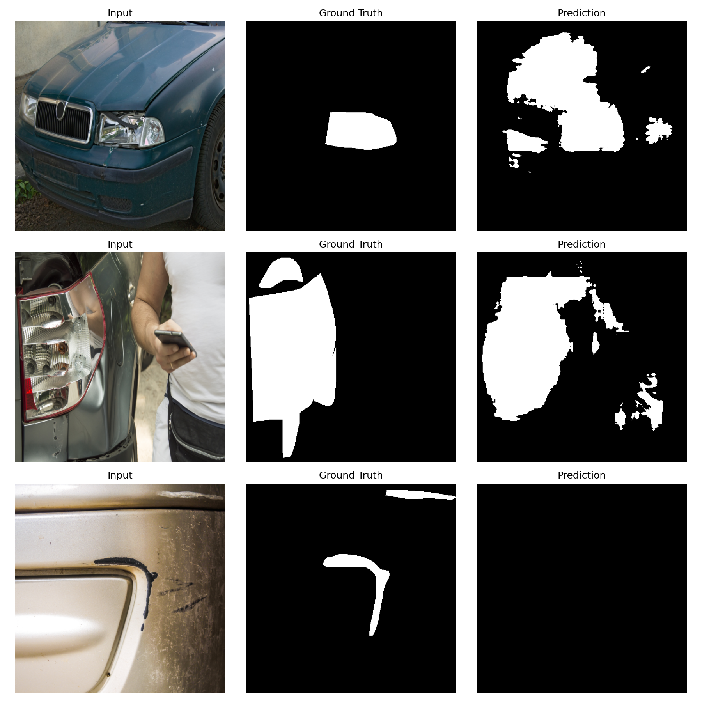
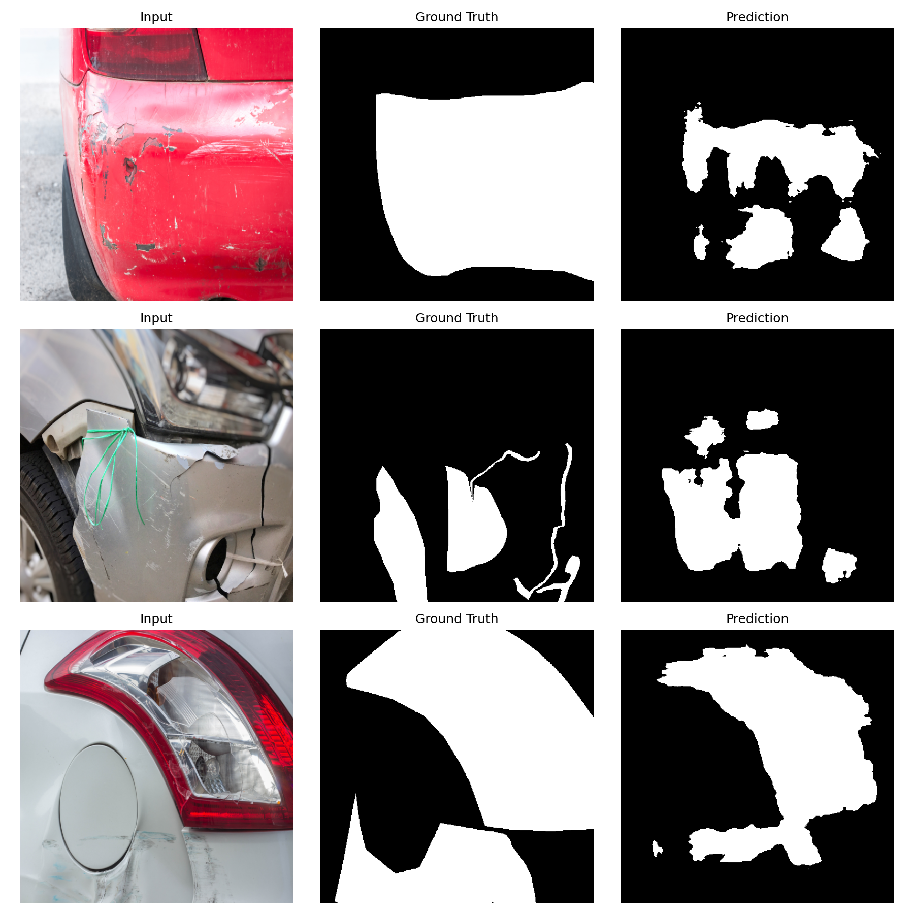
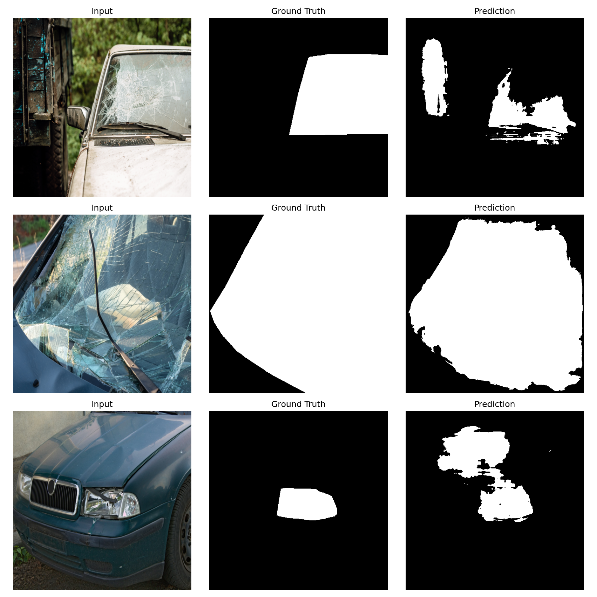
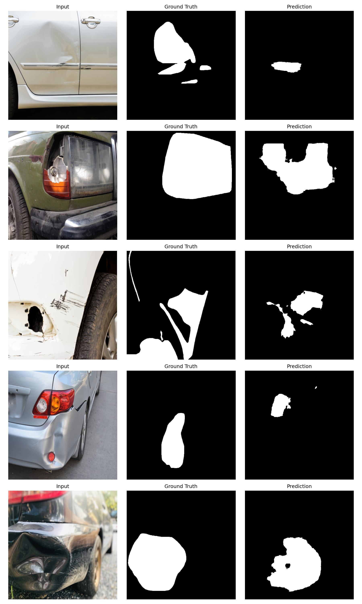

# Segment-Damage

PyTorch repository for vehicle damage segmentation on CarDD, designed for reproducible baseline research and rapid ablation studies.

This project provides:

- A modular U-Net segmentation pipeline.
- Flexible loss composition (CE, Dice, Focal, Gradient Boundary, and hybrids).
- Optional feature projection module before segmentation logits.
- Optional dent classification task head for multi-task training.
- Automated experiment sweeps with per-run config generation.
- Structured metric summaries with DET_l-first ranking for tiny-damage performance.

## Why This Repository

Segment-Damage is built in the style of modern vision repositories: clear experiment entry points, reproducible YAML configs, and standardized output artifacts that are easy to compare and share.

The default workflow is:

1. Prepare split JSON files.
2. Train a run from a YAML config.
3. Evaluate one or more splits.
4. Track metrics and artifacts in output folders.
5. Run sweep scripts for optimizer/loss ablations.

## Highlights

- Clean architecture split across backbone, feature projector, and task head.
- Configurable optimizer and scheduler families (AdamW, Adam, SGD, RMSprop; cosine annealing and plateau scheduling).
- Built-in tiny-damage proxy metric (DET_l) and scoreboard generation.
- Run summary JSON with leaderboards by split.
- TensorBoard logging, checkpointing, and qualitative visualizations.

## Repository Layout

```text
Segment-Damage/
  configs/
    week1_unet.yaml
    baseline_optimizations.yaml
    feature_projector_ce_dice_focal_grad.yaml
  data/
    cardd_dataset.py
    splits/
  models/
    backbone/unet.py
    task_heads/feature_projector.py
    task_heads/segmentation_head.py
    segmentor.py
  tools/
    prepare_cardd_splits.py
    train_week1.py
    evaluate_week1.py
    run_baseline_optimizations.py
  outputs/
```

## Installation

### 1. Create environment

```bash
python -m venv .venv
source .venv/bin/activate
```

### 2. Install dependencies

```bash
pip install -r requirements.txt
```

Dependencies are listed in requirements.txt and include PyTorch, torchvision, NumPy, Pillow, PyYAML, tqdm, matplotlib, and TensorBoard.

## Dataset Preparation (CarDD)

The dataset loader expects paired image and mask files with identical filename stems.

Example:

- image: car_0001.jpg
- mask: car_0001.png

Generate train/val/test splits:

```bash
python tools/prepare_cardd_splits.py \
  --image-dir data/CarDD_release/CarDD_release/CarDD_SOD/CarDD-TR/CarDD-TR-Image \
  --mask-dir data/CarDD_release/CarDD_release/CarDD_SOD/CarDD-TR/CarDD-TR-Mask \
  --output-dir data/splits \
  --train-ratio 0.7 \
  --val-ratio 0.15 \
  --seed 42
```

The generated split files are JSON payloads used directly by training and evaluation scripts.

## Quick Start

### Train the baseline

```bash
python tools/train_week1.py --config configs/week1_unet.yaml
```

### Evaluate a checkpoint

```bash
python tools/evaluate_week1.py \
  --config configs/week1_unet.yaml \
  --checkpoint outputs/week1_unet/best.pt \
  --split val \
  --results-dir outputs/week1_unet/eval/val
```

### Train and evaluate feature projector variant

```bash
python tools/train_week1.py --config configs/feature_projector_ce_dice_focal_grad.yaml
python tools/evaluate_week1.py \
  --config configs/feature_projector_ce_dice_focal_grad.yaml \
  --checkpoint outputs/feature_projector_ce_dice_focal_grad/best.pt \
  --split val \
  --results-dir outputs/feature_projector_ce_dice_focal_grad/eval/val
```

## Experiment Sweeps

Run optimizer/loss ablations from a single command:

```bash
python tools/run_baseline_optimizations.py \
  --base-config configs/week1_unet.yaml \
  --experiments-config configs/baseline_optimizations.yaml \
  --output-root outputs/baseline_optimizations \
  --evaluate-splits train val test \
  --comparison-split val \
  --comparison-visualize-samples 3
```

Useful flags:

- --epochs-override 2 (smoke tests)
- --continue-on-error (do not stop whole sweep on one failed run)
- --tiny-area-threshold 1500 (DET_l sensitivity)

Each experiment receives:

- A generated resolved config under outputs/.../generated_configs.
- A dedicated output directory with checkpoints/history/TensorBoard.
- Split-wise metrics and qualitative samples.

## Configuration Guide

Primary YAML files:

- configs/week1_unet.yaml: baseline training and model defaults.
- configs/baseline_optimizations.yaml: experiment matrix with nested overrides.
- configs/feature_projector_ce_dice_focal_grad.yaml: projector-enabled recipe.

Core configuration groups:

- dataset: image paths, mask paths, split JSONs, resize target.
- model: backbone channels, class count, optional feature projector settings.
- training: epochs, batch size, optimizer, scheduler, loss composition, logging/output paths.

Optional dent classification setup:

- Set model.dent_classification.enabled: true.
- Provide dataset.class_labels_file as a JSON map from sample id to class indices.
- Enable auxiliary classification loss with training.loss.classification.enabled: true.
- For multi-label classification set training.loss.classification.multilabel: true.

Generate class labels directly from CarDD COCO annotations:

```bash
python tools/prepare_dent_class_labels.py \
  --annotations \
    data/CarDD_release/CarDD_release/CarDD_COCO/annotations/instances_train2017.json \
    data/CarDD_release/CarDD_release/CarDD_COCO/annotations/instances_val2017.json \
    data/CarDD_release/CarDD_release/CarDD_COCO/annotations/instances_test2017.json \
  --output data/splits/dent_class_labels.json \
  --label-type multilabel
```

Then set in config:

- dataset.class_labels_file: data/splits/dent_class_labels.json
- model.dent_classification.num_classes: number of CarDD categories in your label map
- training.loss.classification.multilabel: true

Supported loss names:

- ce
- dice
- focal
- grad
- ce_dice
- ce_focal
- dice_focal
- ce_dice_focal

Gradient boundary supervision can also be added as an auxiliary term by setting training.loss.use_gradient: true.

## Metrics and Ranking

Evaluation outputs include:

- DET_l (tiny-damage proxy recall)
- mIoU
- IoU_per_class
- F1_proxy
- tiny_true_positive and tiny_false_negative
- Multi-label dent classification metrics:
  - cls_accuracy (exact-match)
  - cls_micro_f1 and cls_macro_f1
  - cls_per_class_precision, cls_per_class_recall, cls_per_class_f1
  - cls_per_class_ap and cls_mAP
  - Embedding separation diagnostics:
    - cls_centroid_cosine_distance and cls_inter_class_centroid_distance_mean
    - cls_per_class_intra_distance

For sweep ranking, leaderboards are sorted in this order:

1. DET_l
2. mIoU
3. F1_proxy

Summary files are written to:

- outputs/baseline_optimizations/summary.json

And include:

- per-experiment status and timing
- resolved settings snapshot
- artifact paths
- split scorecards
- global leaderboard and per-split leaderboards

## Current Best Results (Validation)

The table below reflects the current top experiments from outputs/baseline_optimizations/summary.json, ranked by DET_l first.

| Rank | Experiment | DET_l | mIoU | F1_proxy |
| --- | --- | ---: | ---: | ---: |
| 1 | adamw_cosine | 0.6667 | 0.5995 | 0.7496 |
| 2 | adamw_plateau | 0.5000 | 0.6039 | 0.7531 |
| 3 | adamw_ce_focal | 0.5000 | 0.5851 | 0.7383 |
| 4 | feature_projector_ce_dice_focal_grad | 0.5000 | 0.5597 | 0.7177 |

### Qualitative Eval Samples (Val Split)

#### Rank 1: adamw_cosine



#### Rank 2: adamw_plateau



#### Rank 3: adamw_ce_focal



## Feature Projector Multi-Task Result (Validation)

The table below summarizes the latest `feature_projector_ce_dice_focal_grad` run evaluated on the val split from `outputs/feature_projector_ce_dice_focal_grad/eval/val/metrics.json`.

| Experiment | DET_l | mIoU | F1_proxy | cls_accuracy | cls_micro_f1 | cls_macro_f1 | cls_mAP |
| --- | ---: | ---: | ---: | ---: | ---: | ---: | ---: |
| feature_projector_ce_dice_focal_grad | 0.5000 | 0.5597 | 0.7177 | 0.2630 | 0.6153 | 0.3734 | 0.4839 |

### Per-Class AP (Val)

| Class | AP |
| --- | ---: |
| dent | 0.6437 |
| scratch | 0.6202 |
| crack | 0.2680 |
| glass shatter | 0.9007 |
| lamp broken | 0.2874 |
| tire flat | 0.1836 |

### Qualitative Eval Samples (feature_projector_ce_dice_focal_grad, Val)



## Output Convention

Per training run:

- best.pt (best validation checkpoint)
- last.pt (latest checkpoint)
- history.json (epoch losses)
- tensorboard/ (scalars)
- visualizations/ (epoch snapshots)

Per evaluation split:

- metrics.json
- visualizations/eval_samples.png

## Reproducibility Checklist

- Fix random seeds for data split generation.
- Keep generated configs for each run.
- Report exact command and checkpoint path.
- Compare runs on the same split and tiny-area threshold.

## Development Roadmap

- Improve tiny-object localization under heavy class imbalance.
- Add additional backbones and decoders.
- Expand metric coverage for detection-oriented assessment.
- Add test coverage and CI for core scripts.

## Contributing

Contributions are welcome. For model or training changes, include:

- motivation and expected impact
- modified/new config files
- before/after metrics (with DET_l highlighted)
- exact reproduction command

## License

This repository is released under the MIT License.

See LICENSE for details.

## Citation

If this repository helps your research, please cite:

1. This Segment-Damage repository.
2. The CarDD dataset paper/source.
