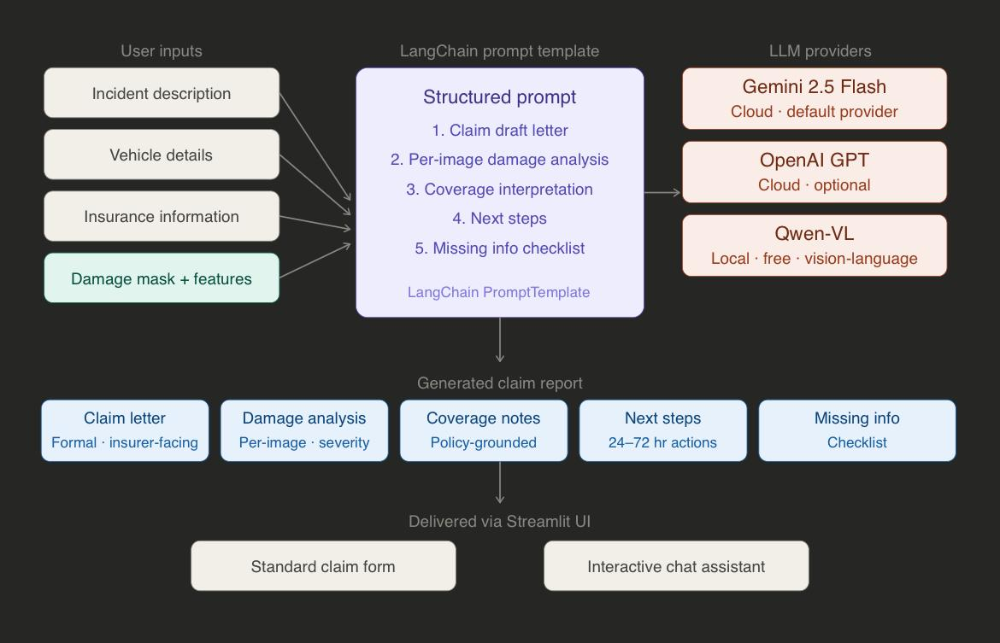
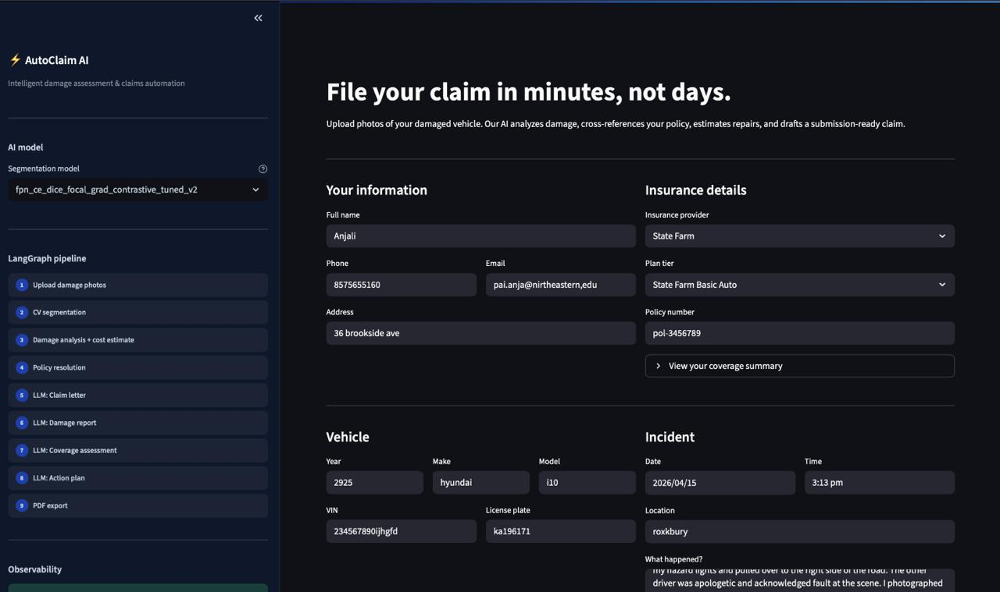
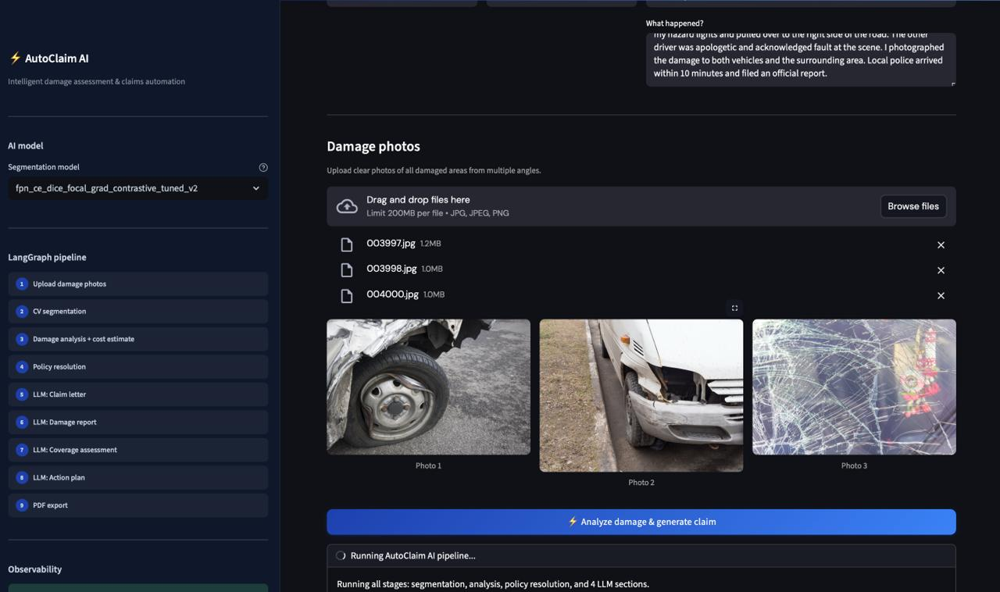
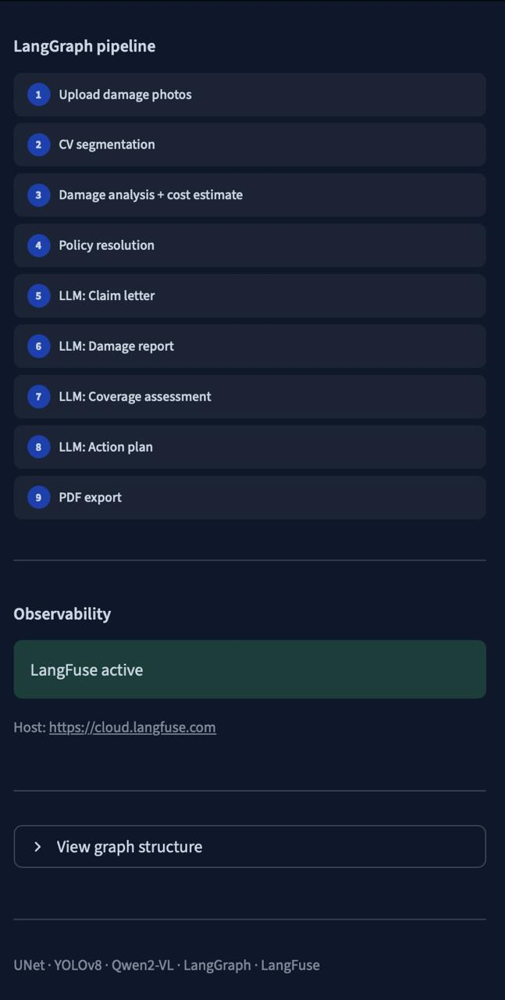
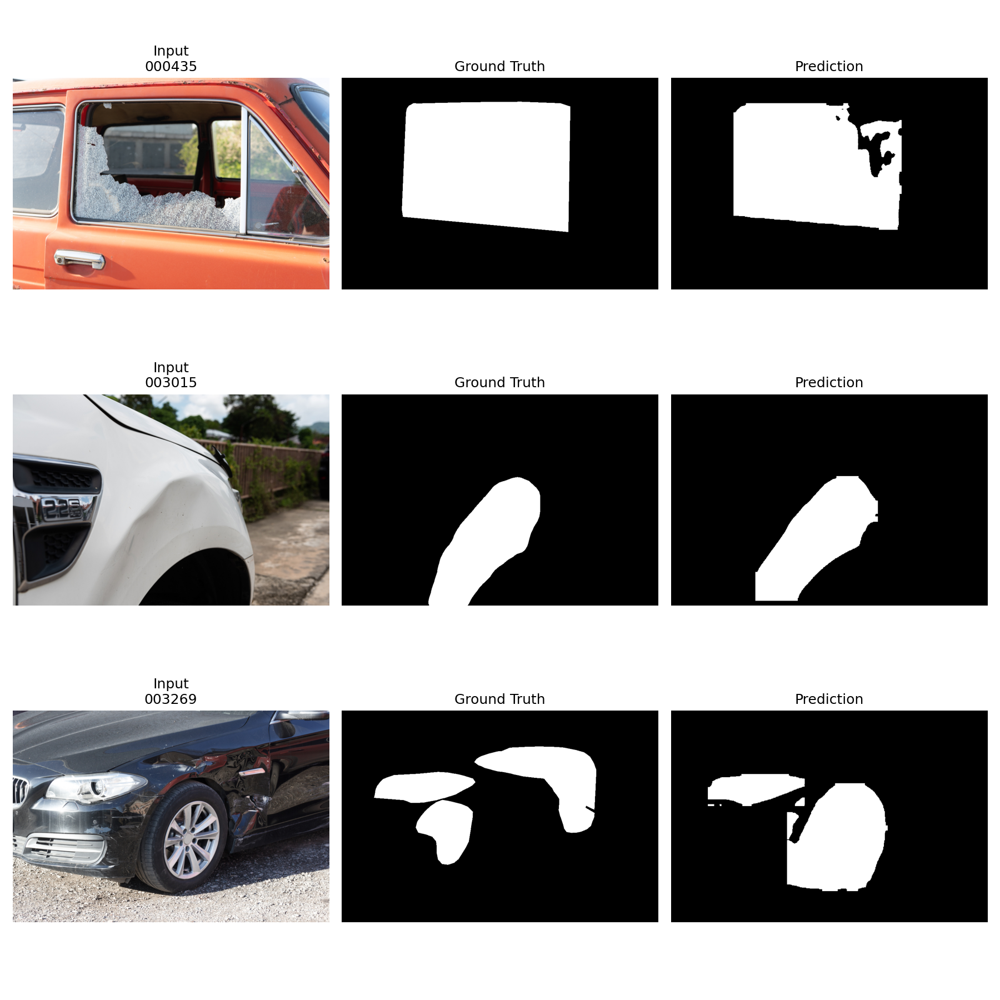
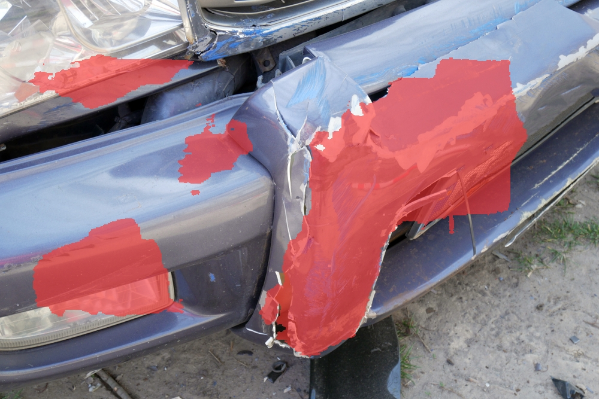
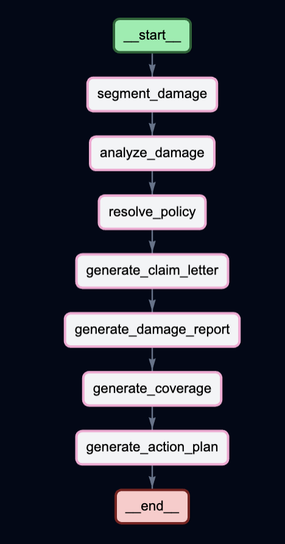
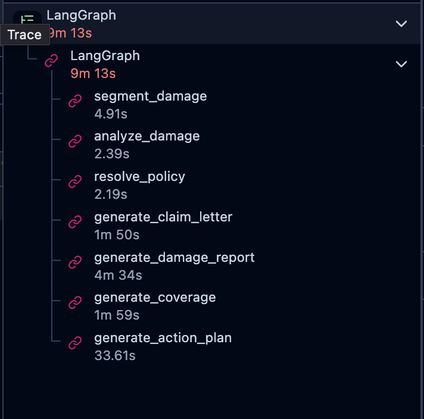

# Segment-Damage

## AutoClaim AI: Multi-Model Segmentation and LLM-Powered Claims for Automotive Insurance

This repository presents **Segment-Damage**, a PyTorch-based project focused on vehicle damage segmentation and automated insurance claim generation. It is designed for reproducible baseline research and rapid ablation studies on the CarDD dataset.

## Motivation and Objectives

**Motivation:** The traditional process of vehicle insurance claims often involves costly and inconsistent manual inspections. Furthermore, the potential of large language models for structured document generation in this domain remains largely untapped.

**Objectives:** This project aims to address these challenges by:

1.  **Detecting all damage:** Implementing pixel-precise instance segmentation using advanced models like UNet, YOLOv8, and Mask2Former.
2.  **Quantifying severity:** Extracting detailed features such as damage area, class, location, and severity.
3.  **Generating claim drafts:** Utilizing LLM-powered structured reports with models like Gemini, GPT, and Qwen-VL.
4.  **Providing an end-to-end product:** Developing a Streamlit-based user interface for image upload and generation of submission-ready reports.

## Features

Segment-Damage offers a comprehensive set of features:

*   A modular U-Net segmentation pipeline.
*   Flexible loss composition, including CE, Dice, Focal, Gradient Boundary, and various hybrid approaches.
*   Optional feature projection module for enhanced segmentation logits.
*   Optional dent classification task head for multi-task training.
*   Automated experiment sweeps with per-run configuration generation.
*   Structured metric summaries, featuring DET_l-first ranking for tiny-damage performance.
*   Clean architecture with clear separation of backbone, feature projector, and task head.
*   Configurable optimizer and scheduler families (AdamW, Adam, SGD, RMSprop; cosine annealing and plateau scheduling).
*   Built-in tiny-damage proxy metric (DET_l) and scoreboard generation.
*   Run summary JSON with leaderboards by split.
*   TensorBoard logging, checkpointing, and qualitative visualizations.

## Methodology

The project employs a multi-stage methodology combining computer vision for damage segmentation and large language models for claim generation.

### 1. Segmentation Layer

Baseline models utilized for pixel-precise instance segmentation include:

*   **YOLOv8-seg:** FPN neck, instance segmentation, multi-loss training.
*   **UNet:** Encoder-decoder, CE + Dice baseline, 32 base channels.
*   **Mask2Former:** Transformer-based, masked attention, panoptic segmentation.

Additional modifications on top of these baselines include:

*   **Feature Projection:** 1x1 conv stack, BatchNorm + ReLU, optional residual path, wider backbone (48ch), and a segmentation head for damage masks.
*   **Dent Classification Head:** Global average pooling, MLP classifier, multi-task side branch, and class-aware contrastive loss on embeddings.
*   **Training Supervision:** Comprehensive loss functions including CE + Dice + Focal, Gradient boundary loss, pixel contrastive loss (for tiny damage focus), and class-aware contrastive and boundary gradient loss.

### 2. LLM Claim Generation Layer

The claim generation process leverages large language models and LangChain for structured reporting:



*   **LangChain Prompt Template:** Used for claim letter generation, damage analysis, coverage assessment, next steps, and checklist.
*   **LLMs:** Gemini 2.5 Flash, OpenAI GPT, and Qwen-VL are integrated for generating claim-related text.
*   **LangGraph:** The claim generation pipeline is orchestrated using LangGraph, replacing sequential calls with a proper stateful graph. This includes nodes for segment damage, analyze damage, resolve policy, generate claim letter, generate damage report, generate coverage, and generate action plan.

### 3. User Interface

A Streamlit application (`server/app.py`) provides the user interface for image upload and interaction with the LLM-powered claim generation system.





## Generated Reports

Sample outputs produced by the AutoClaim AI pipeline:

- [Insurance Claim Report (PDF)](reports/autoclaim_report.pdf)
- [Insurance Claim Letter (TXT)](reports/claim_letter.txt)

## Repository Layout

```
Segment-Damage/
  assets/
  configs/
    week1_unet.yaml
    baseline_optimizations.yaml
    feature_projector_ce_dice_focal_grad.yaml
  data/
    cardd_dataset.py
    splits/
  models/
    backbone/unet.py
    task_heads/feature_projector.py
    task_heads/segmentation_head.py
    segmentor.py
  notebooks/
  server/
    generative_ai/
      core/
        claim_drafter.py
        claim_graph.py
        llm_clients.py
        tracing.py
      prompts/
      README.md
      __init__.py
    services/
    app.py
    requirements.txt
  tools/
    prepare_cardd_splits.py
    train_week1.py
    evaluate_week1.py
    run_baseline_optimizations.py
  outputs/
  .gitignore
  LICENSE
  README.md
  main.tex
  requirements.txt
```

## Installation

### 1. Create environment

```shell
python -m venv .venv
source .venv/bin/activate
```

### 2. Install dependencies

```shell
pip install -r requirements.txt
```

Dependencies are listed in `requirements.txt` and include PyTorch, torchvision, NumPy, Pillow, PyYAML, tqdm, matplotlib, and TensorBoard.

## Dataset Preparation (CarDD)

The dataset loader expects paired image and mask files with identical filename stems (e.g., `car_0001.jpg` and `car_0001.png`).

Generate train/val/test splits:

```shell
python tools/prepare_cardd_splits.py \
  --image-dir data/CarDD_release/CarDD_release/CarDD_SOD/CarDD-TR/CarDD-TR-Image \
  --mask-dir data/CarDD_release/CarDD_release/CarDD_SOD/CarDD-TR/CarDD-TR-Mask \
  --output-dir data/splits \
  --train-ratio 0.7 \
  --val-ratio 0.15 \
  --seed 42
```

The generated split files are JSON payloads used directly by training and evaluation scripts.

## Quick Start

### Train the baseline

```shell
python tools/train_week1.py --config configs/week1_unet.yaml
```

### Evaluate a checkpoint

```shell
python tools/evaluate_week1.py \
  --config configs/week1_unet.yaml \
  --checkpoint outputs/week1_unet/best.pt \
  --split val \
  --results-dir outputs/week1_unet/eval/val
```

### Train and evaluate feature projector variant

```shell
python tools/train_week1.py --config configs/feature_projector_ce_dice_focal_grad.yaml
python tools/evaluate_week1.py \
  --config configs/feature_projector_ce_dice_focal_grad.yaml \
  --checkpoint outputs/feature_projector_ce_dice_focal_grad/best.pt \
  --split val \
  --results-dir outputs/feature_projector_ce_dice_focal_grad/eval/val
```

## Experiment Sweeps

Run optimizer/loss ablations from a single command:

```shell
python tools/run_baseline_optimizations.py \
  --base-config configs/week1_unet.yaml \
  --experiments-config configs/baseline_optimizations.yaml \
  --output-root outputs/baseline_optimizations \
  --evaluate-splits train val test \
  --comparison-split val \
  --comparison-visualize-samples 3
```

Useful flags:

*   `--epochs-override 2` (smoke tests)
*   `--continue-on-error` (do not stop whole sweep on one failed run)
*   `--tiny-area-threshold 1500` (DET_l sensitivity)

Each experiment receives:

*   A generated resolved config under `outputs/.../generated_configs`.
*   A dedicated output directory with checkpoints/history/TensorBoard.
*   Split-wise metrics and qualitative samples.

## Configuration Guide

Primary YAML files:

*   `configs/week1_unet.yaml`: baseline training and model defaults.
*   `configs/baseline_optimizations.yaml`: experiment matrix with nested overrides.
*   `configs/feature_projector_ce_dice_focal_grad.yaml`: projector-enabled recipe.

Core configuration groups:

*   `dataset`: image paths, mask paths, split JSONs, resize target.
*   `model`: backbone channels, class count, optional feature projector settings.
*   `training`: epochs, batch size, optimizer, scheduler, loss composition, logging/output paths.

Optional dent classification setup:

*   Set `model.dent_classification.enabled: true`.
*   Provide `dataset.class_labels_file` as a JSON map from sample id to class indices.
*   Enable auxiliary classification loss with `training.loss.classification.enabled: true`.
*   For multi-label classification set `training.loss.classification.multilabel: true`.

Generate class labels directly from CarDD COCO annotations:

```shell
python tools/prepare_dent_class_labels.py \
  --annotations \
    data/CarDD_release/CarDD_release/CarDD_COCO/annotations/instances_train2017.json \
    data/CarDD_release/CarDD_release/CarDD_COCO/annotations/instances_val2017.json \
    data/CarDD_release/CarDD_release/CarDD_COCO/annotations/instances_test2017.json \
  --output data/splits/dent_class_labels.json \
  --label-type multilabel
```

Then set in config:

*   `dataset.class_labels_file`: `data/splits/dent_class_labels.json`
*   `model.dent_classification.num_classes`: number of CarDD categories in your label map
*   `training.loss.classification.multilabel`: `true`

Supported loss names:

*   `ce`
*   `dice`
*   `focal`
*   `grad`
*   `ce_dice`
*   `ce_focal`
*   `dice_focal`
*   `ce_dice_focal`

Gradient boundary supervision can also be added as an auxiliary term by setting `training.loss.use_gradient: true`.

## Metrics and Ranking

Evaluation outputs include:

*   DET_l (tiny-damage proxy recall)
*   mIoU
*   IoU_per_class
*   F1_proxy
*   tiny_true_positive and tiny_false_negative
*   Multi-label dent classification metrics:
    *   cls_accuracy (exact-match)
    *   cls_micro_f1 and cls_macro_f1
    *   cls_per_class_precision, cls_per_class_recall, cls_per_class_f1
    *   cls_per_class_ap and cls_mAP
    *   Embedding separation diagnostics:
        *   cls_centroid_cosine_distance and cls_inter_class_centroid_distance_mean
        *   cls_per_class_intra_distance

For sweep ranking, leaderboards are sorted in this order:

1.  DET_l
2.  mIoU
3.  F1_proxy

Summary files are written to:

*   `outputs/baseline_optimizations/summary.json`

And include:

*   per-experiment status and timing
*   resolved settings snapshot
*   artifact paths
*   split scorecards
*   global leaderboard and per-split leaderboards

## Current Best Results (Validation)

The table below reflects the current top experiments from `outputs/baseline_optimizations/summary.json`, ranked by DET_l first.

| Rank | Experiment | DET_l | mIoU | F1_proxy |
| --- | --- | --: | --: | --: |
| 1 | adamw_cosine | 0.6667 | 0.5995 | 0.7496 |
| 2 | adamw_plateau | 0.5000 | 0.6039 | 0.7531 |
| 3 | adamw_ce_focal | 0.5000 | 0.5851 | 0.7383 |
| 4 | feature_projector_ce_dice_focal_grad | 0.5000 | 0.5597 | 0.7177 |

### Qualitative Eval Samples (Val Split)



#### Damage Overlays





#### Rank 1: adamw_cosine

#### Rank 2: adamw_plateau

#### Rank 3: adamw_ce_focal

## Observability and Pipeline Orchestration

To ensure transparency, debuggability, and performance monitoring of the LLM-powered claim generation pipeline, **Segment-Damage** integrates with LangGraph for workflow orchestration and LangFuse for observability.

### LangGraph Workflow

The claim generation process is structured as a series of interconnected nodes within a LangGraph state machine. This allows for a clear, modular, and traceable execution flow, replacing traditional sequential LLM calls with a robust, stateful graph.



Each node in the graph represents a distinct step in the claim generation process, such as `segment_damage`, `analyze_damage`, `resolve_policy`, `generate_claim_letter`, `generate_damage_report`, `generate_coverage`, and `generate_action_plan`.

### LangFuse Tracing and Metrics

LangFuse is utilized to provide detailed tracing and performance metrics for each step of the LangGraph workflow. This integration offers insights into the execution time of individual LLM calls and other processing steps, facilitating optimization and debugging.



By tracking these metrics, developers can identify bottlenecks, monitor the efficiency of the LLM pipeline, and ensure the system operates within desired performance parameters.

## Conclusion and Future Work

**Conclusion:** AutoClaim AI demonstrates that pixel-level damage segmentation and LLM-powered claim generation can be unified into a practical end-to-end insurance pipeline.

**Future Work:** Future efforts will focus on optimizing segmentation performance across all three model architectures for improved tiny-damage detection. The system also lays the groundwork for a fully grounded, production-ready claims tool, with next steps including tightly coupling LLM outputs to segmentation-derived features and enhancing the UI for a more intuitive, accessible user experience.
